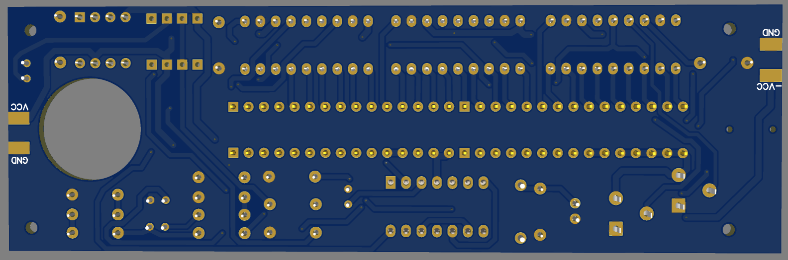
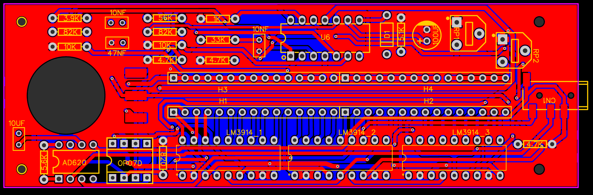

# Biosync
Entwicklung eines EMG-Biofeedback-Systems zur Muskelrehabilitation

Comunidad Moss I.A.P. ist eine Organisation, die sich der Betreuung von Menschen mit Behinderungen widmet. Die Organisation beauftragte die Entwicklung eines EMG-Biofeedback-Systems zur Unterstützung der Muskelrehabilitation ihrer Patienten.

Innerhalb von drei Wochen entwickelten mein Team und ich ein funktionales analoges Elektromyogramm auf Basis von Operationsverstärkern. Der finale Prototyp wurde der Organisation für den klinischen Einsatz gespendet.

Mein Hauptbeitrag bestand in der Erforschung der Funktionsweise und der technischen Parameter von EMG-Systemen sowie in der Entwicklung der analogen Schaltung. Anschließend entwarf ich die Leiterplatte (PCB), die bei JLCPCB hergestellt und in den endgültigen Prototyp integriert wurde.

## Leiterplattendesign
### 3D-Bild der Leiterplatte

### Layout 2D

## Demonstrationsvideo
[Video zur Funktionsweise des Geräts](https://github.com/user-attachments/assets/9134ec29-9233-4f83-af81-fe4e9575d060)

## Mechanische Konstruktion
Das mechanische CAD wurde in Onshape entwickelt von Juan Pablo Montiel López

Onshape-Link:
https://cad.onshape.com/documents/aff586c368c0d7d3878bec46/w/0c55245eadaa12ecfda2da36/e/653c6beef09b0a6465198081?renderMode=0&uiState=698d0ba086d30de9f4b8b440
